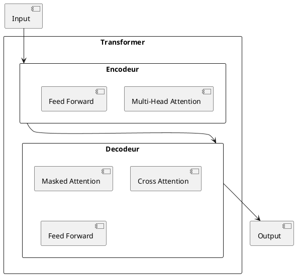

L'intelligence artificielle a connu une revolution ces dernieres annees. Cet article presente les concepts cles pour comprendre les avancees actuelles.

## Les fondamentaux du Machine Learning

Le machine learning repose sur l'idee d'apprendre a partir des donnees plutot que de programmer explicitement des regles.

### Apprentissage supervise

L'apprentissage supervise utilise des exemples etiquetes pour entrainer un modele. Voici un exemple simple avec Python :

```python
from sklearn.linear_model import LogisticRegression
from sklearn.model_selection import train_test_split

# Preparer les donnees
X_train, X_test, y_train, y_test = train_test_split(X, y, test_size=0.2)

# Entrainer le modele
model = LogisticRegression()
model.fit(X_train, y_train)

# Evaluer
accuracy = model.score(X_test, y_test)
print(f"Precision : {accuracy:.2%}")
```

### Apprentissage non supervise

Sans etiquettes, l'algorithme cherche des structures dans les donnees :

```python
from sklearn.cluster import KMeans

# Clustering en 3 groupes
kmeans = KMeans(n_clusters=3, random_state=42)
clusters = kmeans.fit_predict(data)
```

## Les reseaux de neurones

Les reseaux de neurones s'inspirent du cerveau humain pour traiter l'information.

### Architecture d'un reseau

Voici une representation simplifiee d'un reseau de neurones :


### Implementation avec PyTorch

```python
import torch
import torch.nn as nn

class SimpleNet(nn.Module):
    def __init__(self, input_size, hidden_size, output_size):
        super().__init__()
        self.layers = nn.Sequential(
            nn.Linear(input_size, hidden_size),
            nn.ReLU(),
            nn.Linear(hidden_size, output_size),
            nn.Softmax(dim=1)
        )

    def forward(self, x):
        return self.layers(x)

# Creer le modele
model = SimpleNet(input_size=10, hidden_size=64, output_size=3)
```

## Les Transformers

Les transformers ont revolutionne le traitement du langage naturel.

### Architecture simplifiee



### Mecanisme d'attention

Le mecanisme d'attention permet au modele de se concentrer sur les parties pertinentes de l'entree :

```python
import torch.nn.functional as F

def attention(query, key, value, mask=None):
    """Calcul de l'attention scaled dot-product"""
    d_k = query.size(-1)
    scores = torch.matmul(query, key.transpose(-2, -1)) / math.sqrt(d_k)

    if mask is not None:
        scores = scores.masked_fill(mask == 0, -1e9)

    attention_weights = F.softmax(scores, dim=-1)
    return torch.matmul(attention_weights, value)
```

## Conclusion

L'IA moderne repose sur des concepts mathematiques solides et une puissance de calcul considerable. Les transformers representent l'etat de l'art actuel pour de nombreuses taches.

Dans un prochain article, nous explorerons les applications pratiques de ces technologies.
