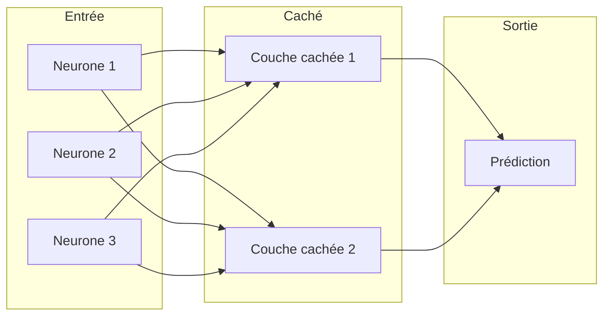

L'intelligence artificielle a connu une révolution ces dernières années. Cet article présente les concepts clés pour comprendre les avancées actuelles.

## Les fondamentaux du Machine Learning

Le machine learning repose sur l'idée d'apprendre à partir des données plutôt que de programmer explicitement des règles.

### Apprentissage supervisé

L'apprentissage supervisé utilise des exemples étiquetés pour entraîner un modèle. Voici un exemple simple avec Python :

```python
from sklearn.linear_model import LogisticRegression
from sklearn.model_selection import train_test_split

# Préparer les données
X_train, X_test, y_train, y_test = train_test_split(X, y, test_size=0.2)

# Entraîner le modèle
model = LogisticRegression()
model.fit(X_train, y_train)

# Évaluer
accuracy = model.score(X_test, y_test)
print(f"Précision : {accuracy:.2%}")
```

### Apprentissage non supervisé

Sans étiquettes, l'algorithme cherche des structures dans les données :

```python
from sklearn.cluster import KMeans

# Clustering en 3 groupes
kmeans = KMeans(n_clusters=3, random_state=42)
clusters = kmeans.fit_predict(data)
```

## Les réseaux de neurones

Les réseaux de neurones s'inspirent du cerveau humain pour traiter l'information.


### Architecture d'un réseau

Voici une représentation simplifiée d'un réseau de neurones :



### Implémentation avec PyTorch

```python
import torch
import torch.nn as nn

class SimpleNet(nn.Module):
    def __init__(self, input_size, hidden_size, output_size):
        super().__init__()
        self.layers = nn.Sequential(
            nn.Linear(input_size, hidden_size),
            nn.ReLU(),
            nn.Linear(hidden_size, output_size),
            nn.Softmax(dim=1)
        )

    def forward(self, x):
        return self.layers(x)

# Créer le modèle
model = SimpleNet(input_size=10, hidden_size=64, output_size=3)
```

## Les Transformers

Les transformers ont révolutionné le traitement du langage naturel.

### Architecture simplifiée


### Mécanisme d'attention

Le mécanisme d'attention permet au modèle de se concentrer sur les parties pertinentes de l'entrée :

```python
import torch.nn.functional as F

def attention(query, key, value, mask=None):
    """Calcul de l'attention scaled dot-product"""
    d_k = query.size(-1)
    scores = torch.matmul(query, key.transpose(-2, -1)) / math.sqrt(d_k)

    if mask is not None:
        scores = scores.masked_fill(mask == 0, -1e9)

    attention_weights = F.softmax(scores, dim=-1)
    return torch.matmul(attention_weights, value)
```

## Conclusion

L'IA moderne repose sur des concepts mathématiques solides et une puissance de calcul considérable. Les transformers représentent l'état de l'art actuel pour de nombreuses tâches.

Dans un prochain article, nous explorerons les applications pratiques de ces technologies.
